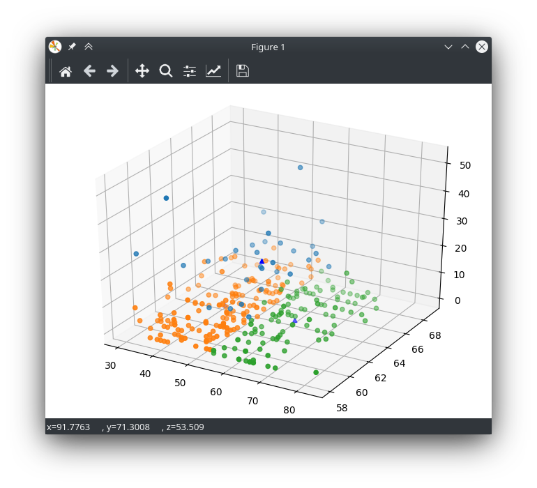

# k-means with Python

You need to install matplotlib with :
`pip3 install matplotlib`

In the figure below the green ponts are for alives and the red points are for deads.

In the figure below each color is a cluster and the 3 triangles are the centroids.

The output is shown below with 3 clusters :

> for cluster of  1  the entropy is  0.9182958340544896 

> for cluster of  2  the entropy is  0.780183978106127 

> for cluster of  3  the entropy is  0.7355085815538398 

